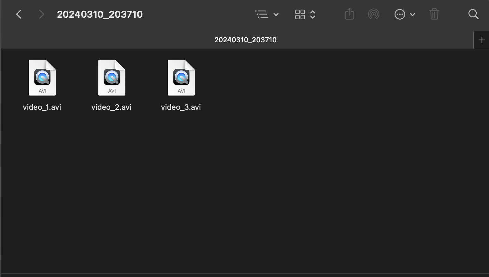

# Crystal Recorder
> OpenCV를 사용해서 만든 간단한 웹캠 레코더 입니다.

1. 사용 방법
* 프로그램 실행 시 대기 모드 (STANDBY)
* 스페이스 바를 눌러 녹화 시작 (RECORDING)
* R 키를 누르면 영상 좌우 반전
* 다시 스페이스바를 누르면 녹화 중지와 동시에 방금 녹화된 영상 빠르게 재생 (PREVIEW)
* ESC 키를 눌러 프로그램 종료

2. 파일 저장
현재 날짜 및 시간으로 된 폴더에, 녹화할 때마다 파일이 하나씩 자동 저장됩니다.

3. 사용 예시
* 대기 모드 

* 녹화 모드

* 녹화 중 좌우 반전

* PREVIEW

